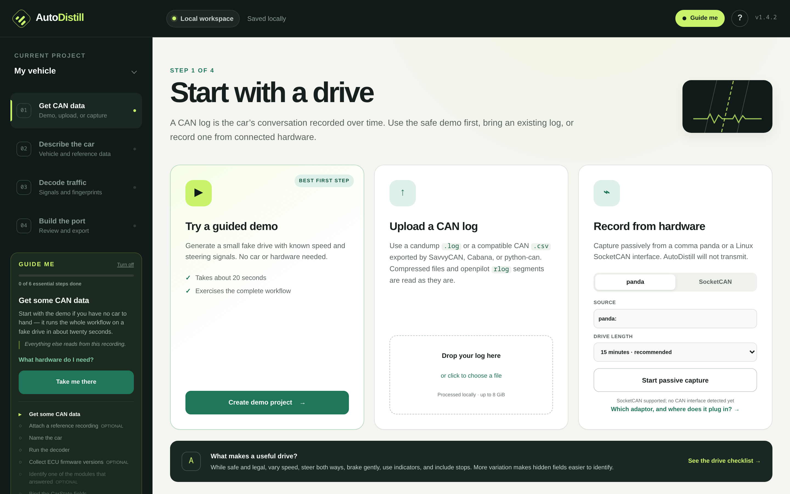
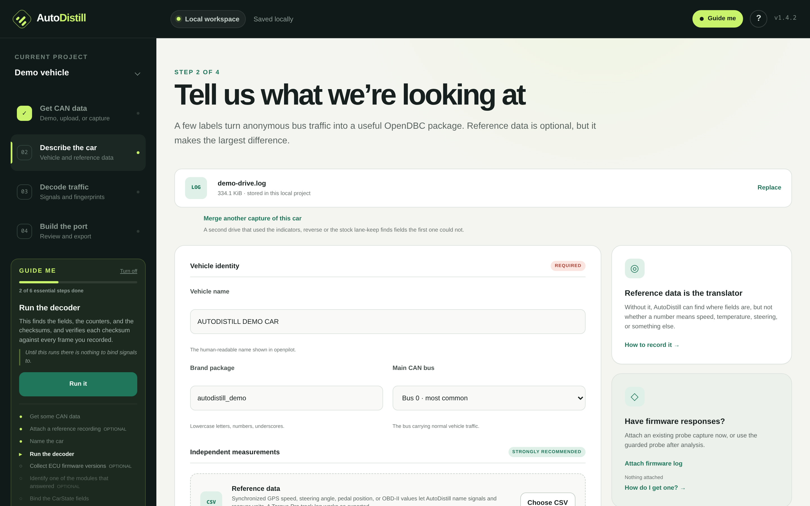
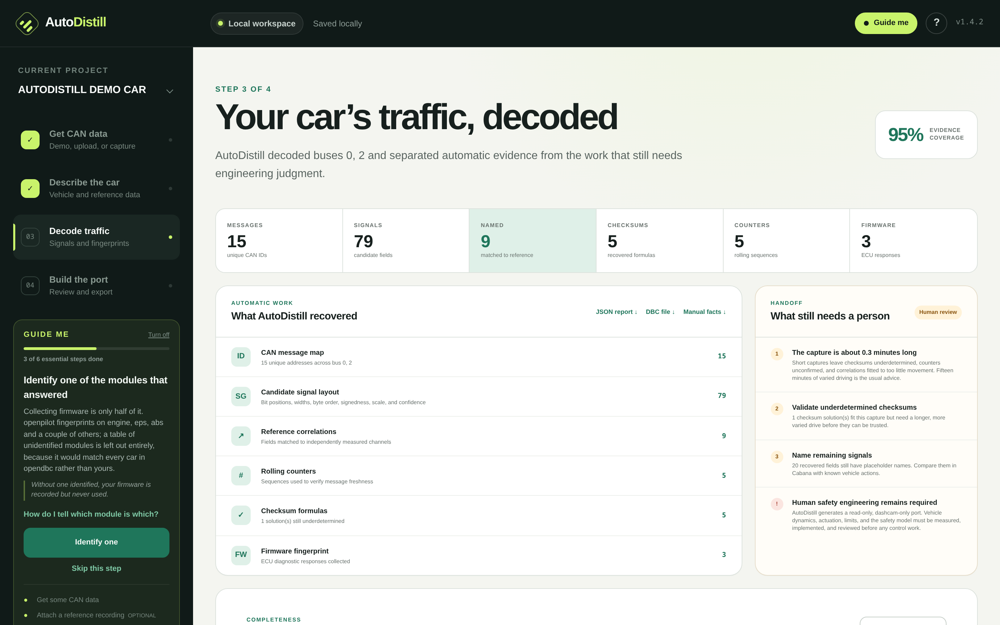
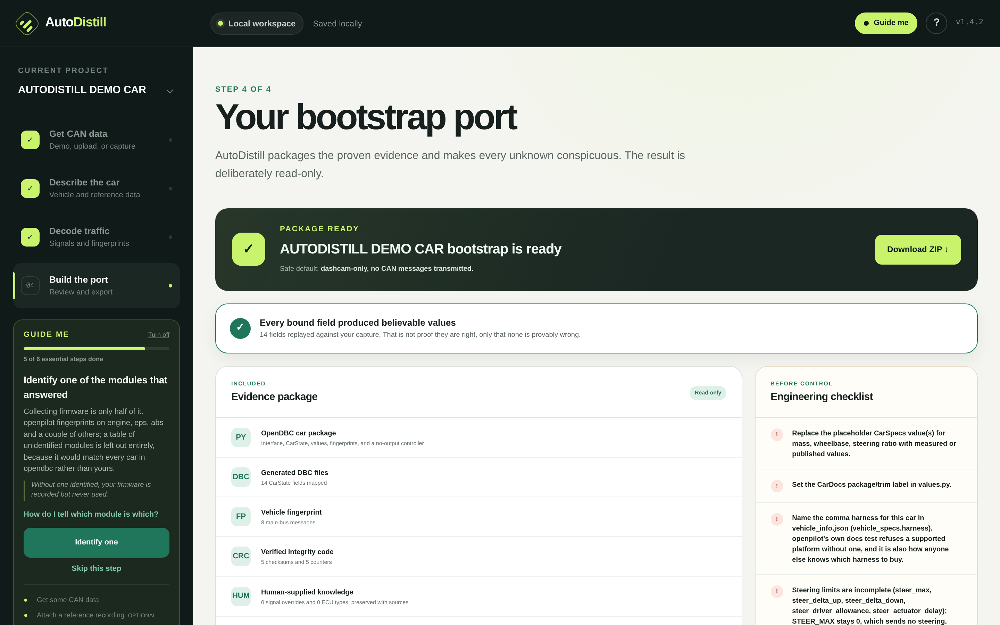

# AutoDistill

> [!WARNING]
> **Disclaimer:** This project is 100% vibed. Review and verify all code, analyses, and generated outputs carefully before use.

**New to CAN or openpilot? Start with the
[plain-language setup and step-by-step guide](README_SIMPLE.md).**

Turn a CAN capture into an [openpilot](https://github.com/commaai/openpilot) car
port. Point it at a log and it works out what the messages mean — where the
fields are, how they are encoded, which one is the rolling counter, how the
checksum is computed — and writes a guarded read-only port package the bundled
installer integrates into an opendbc checkout.

Passive traffic cannot establish actuation limits, a safety model, or vehicle
dynamics, so those stay unfilled. Measure them yourself and hand them over in a
`vehicle-info.json` and the steering and longitudinal control path comes out
finished too — rate-limited, counter-incremented, and checksummed with the
function recovered from your own frames. `safe_for_control` stays `false`
either way; there is no input that changes it.

The analysis core is pure standard library. It runs on a comma device as
happily as on a laptop.

For the guided local web app:

```console
$ autodistill-can ui
```

This opens a step-by-step browser interface for demo data, large local uploads,
passive hardware capture, vehicle details, analysis, human-review checkpoints,
port download, and guarded installation into an OpenDBC checkout. Driving logs
stay on the computer running AutoDistill; the UI binds only to `127.0.0.1`.

**Guide me** — on by default, toggled from the top right — puts the next single
action in the sidebar with the reason for it, and highlights the control when
you click through. The task list is derived from the project's real state
rather than scripted, so it stays correct if you work out of order or come back
to a half-finished port days later.

### Web application walkthrough

#### Step 1: Start with a drive

Choose the safe built-in synthetic demo, upload a local candump/CSV log, or capture passively from a comma panda or SocketCAN interface.



#### Step 2: Describe the car

Provide vehicle identity details, attach synchronized reference logs (such as GPS speed or OBD-II PIDs), and specify known ECU types or signal layouts.



#### Step 3: Decode traffic

Inspect automatically recovered messages, candidate signals, rolling counters, checksum formulas, and evidence coverage alongside human-review checkpoints.



#### Step 4: Build and validate the port

Review replayed CarState bindings against your capture, examine the generated OpenDBC package and readiness manifest, and install directly into a local checkout.



For a repeatable manual UI acceptance test, including real Toyota RAV4 traffic,
synchronized reference measurements, complete vehicle facts, a pinned official
opendbc comparison target, and an output checker, follow
[`examples/ui_acceptance/README.md`](examples/ui_acceptance/README.md).

For the command line:

```console
$ autodistill-can port drive.log --reference gps.csv --brand mycar --name "My Car 2021"
```

That produces a directory containing `values.py`, `fingerprints.py`,
`carstate.py`, `carcontroller.py`, `interface.py`, `mycarcan.py`, one DBC per
physical bus, a machine-readable readiness manifest, and a README saying
exactly what still needs a human.

**From a capture alone, the generated controller sends nothing** and the port
requests openpilot's `noOutput` safety model. How to actuate a car is not
recoverable from watching its bus — torque limits, ramp rates and the safety
model are not in the traffic — so the tool refuses to guess. What it gives you
is everything needed to _read_ the car, including checksum and counter code
verified against every frame in your capture.

**Supply the missing facts and it completes the port.** `autodistill-can
requirements` lists everything a working long/lat port still needs; put those
answers in a `vehicle-info.json` and the generated `carcontroller.py`,
`values.py` and `interface.py` come out finished — control path, limits, tuning
and safety model included. The distinction the tool keeps is between what it
_inferred_ and what you _told_ it, and `safe_for_control` stays `false` either
way. See [Safety and scope](#safety-and-scope).

No car handy? `autodistill-can synth -d 60 -o drive.log --reference ref.csv` invents
one, with known ground truth.

## What it works out

Given nothing but a log of frames:

- **Field boundaries, width, byte order and signedness.** Where the fields are
  and how to decode them.
- **Rolling counters.** Position, width and increment.
- **Checksums.** Both the common OEM formulas (Toyota, Honda, Hyundai, Subaru,
  VW/AUTOSAR CRC8, SAE-J1850, plain sums and XORs) _and_ previously unseen
  ones, via a generic solver described below.
- **Multiplexed messages**, where one small field selects between several
  payload layouts.
- **The openpilot fingerprint**, with diagnostic traffic correctly excluded.
  `autodistill-can fingerprint drive.log` prints just this, when that is all
  you need.
- **ECU firmware versions**, reassembled from ISO-TP responses in the capture.

Given a reference log as well — GPS speed, OBD-II PIDs, anything with a
timestamp and a number — it also recovers:

- **What the signals actually are**, by correlation.
- **Their scale and offset**, by least-squares fit. A field reading 6234 when
  GPS says 62.34 km/h gets a scale of 0.01, which is exactly what a DBC needs.

Captures compressed with gzip, bzip2, xz or zstandard are read as they are,
by content rather than by name — a fifteen-minute drive is hundreds of
megabytes, and decompressing by hand first is a step that exists only because
the tool would not do it.

**openpilot's own segments work directly.** A comma device in dashcam mode
already logs every frame it sees on every bus, which makes it the best capture
this tool can be given and needs no hardware beyond what porting requires
anyway. Point it at an `rlog`, `rlog.zst` or `rlog.bz2`. Frames openpilot
transmitted are excluded, since they are not the car speaking. This is the one
format that needs a dependency — Cap'n Proto is schema-driven, so it needs
`pip install 'autodistill-can[rlog]'` and openpilot's `log.capnp`, found from
an installed openpilot or `AUTODISTILL_LOG_CAPNP`. The schema is deliberately
not vendored: it changes with openpilot, and a stale copy that still parsed
would be worse than none.

Several captures of the same car can be merged into one analysis with
`--add-log`, laid end to end after the first. One drive rarely exercises
everything: indicators, reverse and blind-spot only turn up in a recording
where someone used them, and the stock lane-keep drive that establishes the
control path is a separate outing from the general one.

A **Torque Pro** CSV export works directly — its wall-clock timestamps, its `-`
for a reading it does not have, and its `Speed (OBD)(km/h)` headers are all
understood, so `--reference trackLog-....csv` is all it takes. Torque is an
OBD-II logger, which decides what it can name for you: vehicle speed, engine
RPM, accelerator pedal, coolant temperature and engine load are all there, and
speed alone identifies the wheel-speed and vEgo signals that a port needs
first. **Steering angle is not an OBD-II PID and is not in the export**, so a
Torque log cannot name the steering signals — for those you need a reference
that measures the wheel, or you identify them by hand. The `.kml` files Torque
writes alongside the CSV carry the same channels for a subset of the rows, so
there is nothing in them the CSV does not already have.

## How it works

Four ideas do most of the work.

**Bit-flip rates find boundaries.** Inside a multi-byte number the low-order
bits change on almost every frame and the high-order bits rarely do, so the
flip rate climbs steadily from a field's most significant bit to its least, then
collapses at the next field's boundary. That asymmetry segments a payload
without knowing anything about the car.

**Physical plausibility settles the encoding.** Flip rates cannot tell a
little-endian field from two separate ones, or a signed value from an unsigned
one. Decoding can: a correctly decoded signal from a car moves _smoothly_, since
road speed and steering angle barely change between frames at 50–100 Hz. Decode
the same bits with the bytes swapped and consecutive values leap across the
range. Read a signed value as unsigned and it splits into two clumps with the
middle of its range empty. Every candidate field is decoded every way and scored
on how much it behaves like a real quantity, then a dynamic program picks the
non-overlapping set that best explains the payload.

**Checksums fall to linear algebra.** Every CRC is an affine function of its
input bits — `crc(data) = L(data) XOR crc(0)` for a fixed linear map `L`. So
rather than brute-forcing polynomial, init and xorout (16 million combinations),
the solver recovers `L` directly by Gaussian elimination over GF(2) in a single
pass, then names the polynomial afterwards by comparing against known parameter
sets. This cracks any CRC, XOR or parity scheme _without knowing which one it
is_. Arithmetic sums are not GF(2)-linear, so those are tried separately from a
registry of OEM formulas.

It also handles the case that defeats textbook approaches: VW's MQB messages mix
in a magic byte selected from a per-address table by the counter value. That is
not linear in the counter bits, so the global solve fails — but one-hot encoding
the counter and solving jointly recovers both the polynomial _and_ the entire
magic table.

**Conditional continuity finds multiplexers.** Multiplexed bytes lurch between
unrelated quantities frame to frame, but follow only the frames sharing one
selector value and they move smoothly again.

## How well it works

Measured against [the synthetic car](#the-synthetic-car), whose layout is
defined independently of every algorithm above:

|                                                               | result                                                  |
| ------------------------------------------------------------- | ------------------------------------------------------- |
| Rolling counters                                              | **5/5** exact, 0 false positives                        |
| Checksums                                                     | **5/5** exact position and algorithm, 0 false positives |
| Multiplexers                                                  | **1/1** exact, 0 false positives                        |
| Signal boundaries                                             | **32/46** (70%)                                         |
| Signals fully exact (position, width, byte order, signedness) | **24/46** (52%)                                         |
| Generated checksum code                                       | 17,100 frames reproduced, **0** mismatches              |

Two things are worth saying plainly about that table.

The **counter and checksum results are the trustworthy ones**, because they are
_proved_ rather than inferred — a counter increments or it does not, and a
checksum reproduces every frame or it does not. The generated checksum code is
verified in the test suite by executing it against every captured frame.

The **52% figure is a starting point, not an answer.** Fully automatic layout
recovery gets most of a message right and some of it wrong, and no amount of
statistics fixes a field that never moved during the capture. That is why the
report ends with a section listing what it could _not_ determine and what to
record next time. Reverse engineering a car is iterative; the tool's job is to
do the tedious parts and be honest about the rest.

### On a real car

`examples/run_kia_soul_ev.sh` runs the whole pipeline against a public capture
of a real Kia Soul EV and scores it against the human-written DBC shipped
alongside it. On the two signals the car actually exercised:

| DBC says                                  | AutoDistill recovered |                                                                                  |
| ----------------------------------------- | --------------------- | -------------------------------------------------------------------------------- |
| `STEERING_WHEEL_ANGLE : 0\|16@1- (0.1,0)` | `0\|16@1- (0.1,0)`    | identical — position, width, little-endian, signed, scale                        |
| `BRAKE_PRESSURE : 32\|12@1+ (0.1,0)`      | `32\|16@1+ (0.1,0)`   | 4 bits too wide; decodes to the same values, as the top nibble never leaves zero |
| `WHEEL_SPEED` x4                          | not found             | the car never moved; reported as "64 of 64 bits never changed"                   |

It also found a **rolling counter and a 4-bit checksum on the steering message
that the human DBC does not document** — verified by hand, and exactly what you
need in order to send that message.

### Against real opendbc layouts

`tools/benchmark_dbcs.sh` drives a simulated vehicle through the databases
openpilot actually ships, encoding with cantools, and scores what comes back.
This is the broadest check available without a fleet of cars: thousands of
signals laid out the way real manufacturers laid them out, with the answer
supplied.

| database           | signals  | exact          | position       | byte order        |
| ------------------ | -------- | -------------- | -------------- | ----------------- |
| hyundai_2015_ccan  | 987      | 506 (51%)      | 664 (67%)      | **85/85**         |
| vw_mqb             | 1292     | 513 (40%)      | 670 (52%)      | **99/99**         |
| mazda_3_2019       | 123      | 58 (47%)       | 91 (74%)       | 33/37             |
| tesla_model3_party | 182      | 104 (57%)      | 136 (75%)      | 13/15             |
| tesla_powertrain   | 74       | 41 (55%)       | 53 (72%)       | 6/6               |
| nissan_xterra_2011 | 13       | 2 (15%)        | 8 (62%)        | 2/9               |
| **total**          | **2671** | **1224 (46%)** | **1622 (61%)** | **238/251 (95%)** |

"Exact" is demanding — position, width, byte order and signedness all correct,
with a field one bit too wide counted as a miss. The remaining gap is mostly
adjacent sub-byte flags being merged, which is the genuinely hard case: a 2-bit
field beside another 2-bit field has no ramp between them to find.

Byte order is worth calling out separately, because it is the thing a whole
message hangs on. Hyundai and VW are wholly Intel and Mazda is almost wholly
Motorola, so the 95% is not a detector that has learned to say "Intel".

These figures are reproducible: `tools/benchmark_dbcs.sh` with no arguments
regenerates them. They do depend on how hard the simulated drive exercises each
signal — the same run at 60 seconds instead of 90 scores 43% exact rather than
46%, which is the same effect a short capture has on a real car.

### At scale, on a real car

`examples/run_recan.sh giulia` runs a full-vehicle capture from the
[ReCAN dataset](https://github.com/Cyberdefence-Lab-Murcia/ReCAN). There is no
DBC to check against, so what this tests is scale and whether the
_self-verifying_ findings hold: a counter either increments or it does not, and
a checksum either reproduces every frame or it does not.

| Alfa Romeo Giulia |                            |
| ----------------- | -------------------------- |
| capture           | 365k frames, 76 messages   |
| counters found    | 31                         |
| checksums solved  | 29                         |
| checksum family   | **all 29 CRC-8/SAE-J1850** |
| frames reproduced | **261,836 / 261,836**      |

Re-measured against the current code, not quoted from an old run: the analysis
takes 54 seconds, and every one of the 29 generated checksum functions is then
executed against every frame that carries it.

The result is telling because of its internal agreement: twenty-nine messages,
one polynomial, and almost every counter at bit 52 — a single OEM's platform
convention showing through. Random false positives do not agree with each other
like that.

An Opel Corsa column used to sit beside this one. Its capture is no longer on
this machine, and the figures came from a process that had already been
superseded when they were recorded, so there is no way to reproduce or correct
them. They have been removed rather than reprinted: a number nobody can check
is worth less than no number.

### Checked against opendbc's own test suite

CI installs both a read-only and a control port into a fresh opendbc checkout
and runs **opendbc's own car tests** against them:

```
271 passed, 281 skipped, 4861 subtests passed
```

That covers `test_car_interfaces`, `test_docs`, `test_platform_configs` and
`test_fw_fingerprint` — the last of which is the one that matters most, and the
reason it is worth running the real suite rather than asserting on generated
text. An earlier version of the generated `FW_VERSIONS` table listed ECUs whose
type nobody had identified yet. openpilot skips a _missing_ non-essential ECU
when matching firmware, and an unidentified ECU is never essential, so that
table could never be ruled out: it matched **every car in opendbc**. Installing
that port broke fingerprinting for 460 unrelated vehicles, and both
`test_car_interfaces` and `test_docs` passed the whole time.

A port therefore declares firmware tables in exactly one of three states:

| what the capture found       | `FW_VERSIONS` | `FW_QUERY_CONFIG`                   |
| ---------------------------- | ------------- | ----------------------------------- |
| no UDS responses             | not declared  | not declared                        |
| responses, no ECU identified | `{}`          | declared, addresses in `extra_ecus` |
| an essential ECU identified  | real table    | declared                            |

The two are always declared together, because opendbc indexes
`FW_QUERY_CONFIGS[brand]` for every brand in `VERSIONS` — declaring one without
the other raises `KeyError` inside fingerprinting for every car in the
database.

One test is deselected: `test_fw_query_timing` looks each brand up in a
hardcoded reference-time table upstream, so it raises `KeyError` for any new
brand, generated or hand-written, until opendbc adds an entry.

### Checked against openpilot's own implementations

`tests/test_opendbc_vectors.py` pins our checksum arithmetic to real frames that
openpilot ships in its own test suite — messages captured from real cars, each
carrying the checksum its ECU actually produced. That is stronger than any
self-consistency check: not "our encoder agrees with our decoder" but "our
arithmetic agrees with a Volkswagen".

- **FCA Giorgio** (the Alfa Giulia platform): the formula AutoDistill recovered
  from a raw Giulia capture reproduces opendbc's own EPS and ABS test frames.
  We report it as CRC-8/SAE-J1850 with init and xorout 0xFF; opendbc writes the
  same platform as init 0x00 with a per-address final XOR. Those are two
  spellings of one function — a CRC is affine, so a change of init is absorbed
  by a constant depending only on message length — and both match the byte the
  car sent.
- **Volkswagen MQB**: 16 real frames, one per counter value, including
  `Getriebe_11` whose magic constant genuinely differs for every counter. A
  fixed CRC explains at most one of them; ours explains all sixteen.

Two defects surfaced only because of this, both now fixed:

- **Honda's checksum takes an extra `+3` on 29-bit identifiers.** Ours was right
  on every standard-id message and wrong on every extended one.
- **opendbc's `mk_crc8_fun(init_crc=...)` does not mean what it looks like** —
  the register starts at `init_crc ^ xor_out`. Hyundai's stated init of 0xFD is
  really 0x22, and copying the literal across gave a checksum that disagreed
  with the car on every single frame.

### What testing on real cars changed

Every one of these was invisible to the hand-written fixture and only appeared
once real vehicles and real databases were involved. All are fixed, with
regression tests built from the shapes that exposed them.

- **Unaligned Intel fields could not be expressed at all.** A 12-bit
  little-endian signal occupies a _non-contiguous_ set of bits under MSB-first
  numbering, so the internal model simply had no way to describe one — and they
  are 4% of opendbc's Hyundai signals, including vehicle speed and longitudinal
  acceleration. Fixed by analysing byte-reversed payloads, which turns any Intel
  field into a plain contiguous big-endian one with the same value.
- **Byte order was decided per message**, where most messages hold no evidence
  either way, since anything narrower than two bytes reads identically. Byte
  order is a property of the _car_: pooling the evidence took Hyundai from 46/86
  messages correct to 87/87.
- **Constant padding counted as evidence of byte order.** A long run of zeroes
  scores well and says nothing, which was enough to swamp the comparison.
- **The bonus for byte-aligned fields was actively harmful**, splitting
  unaligned fields into aligned pieces. Removing it improved recovery on both
  the synthetic car and the real Hyundai layouts.
- **Emitted DBCs did not load.** Multiplexed messages were written with plain
  signals laid over multiplexed ones, and 29-bit identifiers lacked the flag
  that marks them extended — each rejected outright by cantools, and so by
  every real consumer.
- **Multiplexer false positives** on messages whose bytes merely changed
  together, and byte-wide selectors proposed at nibble offsets ("the mode field
  is bits 4-11", which no ECU does).
- **A whole checksum family (nibble XOR) could be cracked but not named**,
  emitting a 60-bit mask table where one line of arithmetic would do.
- **Accuracy was reported as a rounded percentage**, turning 99.996% into
  "100.00%". Now an exact frame count, because for a message openpilot
  transmits, "always accepted" and "rejected once in twenty thousand" are
  different things.

### Known limitations

- Adjacent sub-byte fields merge when nothing separates them; this is most of
  the remaining gap on dense real layouts.
- The checksum solver searches 4-, 8- and 16-bit fields, the last only on
  payloads longer than eight bytes, where CAN-FD platforms put them. Pinning
  down a 16-bit map over a 64-byte payload needs more frames than input bits —
  five hundred or so — and below that the solution is reported as
  `UNDERDETERMINED` rather than as an answer.
- A capture that genuinely mixes byte orders within one car falls back to
  per-message decisions, which are weaker.
- Passive traffic cannot establish safe actuation limits, a panda safety model,
  harness topology, or whether a platform uses unrecoverable SecOC keys. The
  generated port is therefore read-only and dashcam-only until those human
  gates are completed.

## Shipping a port

1. **Capture.** With a panda, or a USB CAN adaptor on SocketCAN:

   ```console
   $ sudo ip link set can0 type can bitrate 500000 listen-only on
   $ sudo ip link set can0 up
   $ autodistill-can capture socketcan:can0 -d 900 -o drive.log
   ```

   `listen-only` means the adaptor never transmits or even acknowledges, so it
   cannot disturb the car.

   Drive so the signals you care about actually move: wheel lock to lock, the
   whole speed range, every door, the blinkers, all the gears, cruise on and
   off. A field that never changes cannot be found, by this or by anyone.

   _Note for CAN-FD platforms:_ Vehicles with 64-byte payloads and 16-bit CRCs require at
   least 500+ frames per message (~5–10 minutes of active driving) for the linear
   solver to uniquely determine 16-bit polynomials without reporting `UNDERDETERMINED`.

2. **Record a reference alongside it.** A phone GPS track, an OBD-II dongle
   polling standard PIDs, openpilot's own logs. This is the single
   highest-value thing you can bring: it is what turns "16-bit big-endian field
   at bit 0" into "wheel speed, 0.01 km/h per bit", and without it `carstate.py`
   comes out empty.

3. **Collect firmware versions**, which is how openpilot fingerprints most cars:

   ```console
   $ autodistill-can probe -i can0 --i-own-this-vehicle \
       --capture firmware.log -o firmware.txt
   ```

   Multi-frame ISO-TP responses are handled automatically. `firmware.log`
   contains the raw response frames, while `firmware.txt` is the readable
   summary. The default probe covers standard OBD/UDS address blocks; for an
   OEM-specific address, repeat `--address`, for example
   `--address 0x730 --address 0x760`.

4. **Add facts the capture cannot reveal.** This is optional, but it lets a
   human pass measured or researched knowledge through the same pipeline rather
   than editing generated files by hand:

   ```console
   $ autodistill-can manual-template -o vehicle-info.json
   ```

   Edit the file, then pass it to `analyse`, `fingerprint`, or `port` with
   `--vehicle-info vehicle-info.json`. For example:

   ```json
   {
     "schema_version": 1,
     "vehicle_specs": {
       "mass_kg": 1845,
       "wheelbase_m": 2.766,
       "steer_ratio": 14.3,
       "docs_package": "All"
     },
     "ecu_types": {
       "0x7E0": "engine",
       "0x730": "eps"
     },
     "signals": [
       {
         "bus": 0,
         "address": "0x123",
         "start_bit": 8,
         "length": 16,
         "name": "VEHICLE_SPEED",
         "unit": "km/h",
         "scale": 0.01,
         "offset": 0,
         "signed": false,
         "byte_order": "big",
         "carstate_target": "ret.vEgoRaw"
       }
     ],
     "engineering": {
       "actuation_notes": ["Workshop manual section 12 describes 0x2E4"],
       "safety_notes": ["Bench validation is still required"],
       "sources": ["Service manual page 418; measured 2026-07-31"]
     }
   }
   ```

   Normally, copy `bus`, `address`, `start_bit`, and `length` from an
   AutoDistill JSON report. If a service document proves that the statistical
   tiler split or merged a field incorrectly, explicit `length`, `signed`,
   and `byte_order` values may correct the boundary over bits present in the recovered
   payload. Counter, checksum, and multiplexer bits are protected and can never
   be overwritten by an override. ECU keys are diagnostic _request_ addresses.
   Names must be DBC-style identifiers. Known CarState targets and ECU types
   are validated instead of silently accepting a typo.

   Manual input is written back out as `vehicle_info.json` and
   `MANUAL_INPUT.md`, with its sources and notes, and is marked `MANUAL` in
   generated code.

   To see exactly what is still missing, and the fragment that would supply
   each one:

   ```console
   $ autodistill-can requirements drive.log --reference gps.csv \
       --vehicle-info vehicle-info.json
   ```

   ```
   read the car (dashcam / logging)        16/16  COMPLETE
   steer the car                           24/24  COMPLETE
   drive the car (gas and brake)           24/26  incomplete

     [  -  ] control.longitudinal             Acceleration command message
              The message and signals that command gas and brake.
              add "actuation": {"longitudinal": {"bus": 0, "address": "0xNNN", …}}
   ```

   Every item is marked `auto` (recovered from the capture), `human`
   (supplied here), `calc` (derived from another field), or missing. Each
   missing one also prints **how to obtain it** — the bench procedure, what to
   measure, or where it is published:

   ```
     [  -  ] ret.gearShifter                  Gear selector
              Mapped onto openpilot's GearShifter enum.
              how: Foot on the brake, engine running, move the selector
                   through every position in turn, pausing in each. Note the
                   raw value at each stop and write them into gear_map.
   ```

   The same text appears in the web app under **How to find it**, and
   [README_SIMPLE.md](README_SIMPLE.md#how-to-obtain-each-fact) works through
   every one of them at length.

5. **Complete the port, if you have done the bench work.** The sections below
   are what turns the inert bootstrap into a working long/lat port. Nothing in
   them is inferable from traffic — each is something you established on the
   car — so AutoDistill only wires them together:

   ```json
   {
     "carstate": [
       {
         "target": "ret.brakePressed",
         "bus": 0,
         "address": "0x1A0",
         "signal": "BRAKE_PRESSURE",
         "transform": "threshold",
         "threshold": 10
       },
       {
         "target": "ret.gearShifter",
         "bus": 0,
         "address": "0x1A0",
         "signal": "GEAR",
         "transform": "gear_map",
         "gear_map": { "0": "park", "5": "drive", "6": "reverse" }
       }
     ],
     "actuation": {
       "lateral": {
         "bus": 0,
         "address": "0x2B0",
         "message": "MSG_2B0",
         "frequency_hz": 100,
         "signals": {
           "STEER_TORQUE": "apply_torque",
           "STEER_REQ": "lat_active"
         },
         "counter_signal": "COUNTER",
         "checksum_signal": "CHECKSUM"
       }
     },
     "limits": {
       "steer_max": 384,
       "steer_delta_up": 3,
       "steer_delta_down": 7,
       "steer_driver_allowance": 50,
       "steer_actuator_delay": 0.1
     },
     "tuning": {
       "lateral": {
         "kind": "torque",
         "max_lateral_accel": 2.5,
         "friction": 0.1
       }
     },
     "safety": { "model": "hyundaiCanfd", "param": 4 }
   }
   ```

   This is only a fragment. Once **every mandatory item** reported by
   the requirements report is complete and the bindings replay cleanly,
   the generated `carcontroller.py` builds and sends the declared message — at
   its exact declared rate, rate-limited, counter incremented, and checksummed
   with the function verified against this car's own captured frames. Until
   then it remains inert and `interface.py` keeps `noOutput`/`dashcamOnly`.

   Three properties hold regardless:
   - **A command message must be one the capture contains.** openpilot can only
     send a message whose layout is in the DBC, and every signal named must be
     a field AutoDistill actually recovered. Use the generated DBC name
     (`MSG_2B0` for address `0x2B0`); inventing an address or OEM-style alias is
     rejected before a broken port is written.
   - **Signal values come from a closed vocabulary** (`apply_torque`,
     `lat_active`, `accel`, … or a number). A vehicle-info file is the kind of
     thing people email each other; free-text expressions in one would be a way
     to run code.
   - **`safe_for_control` stays `false`.** It is not a completeness score.
     AutoDistill cannot drive a car, so it is not the thing that gets to
     declare the port safe — a person who has reviewed and tested it is.

6. **Check the bindings against your own recording.**

   ```console
   $ autodistill-can validate drive.log --reference gps.csv \
       --vehicle-info vehicle-info.json
   ```

   This decodes the capture the way the generated `CarState` will and looks at
   the values. Compiling the port proves it is well formed; this is what
   notices that it is _wrong_:

   ```
   [FAIL] ret.vEgoRaw
          MSG_0AA.SPEED_KPH is in km/h, but the binding uses 'identity'.
          openpilot wants m/s -- use the kph_to_ms transform, or the value is
          wrong by a constant factor at every speed.
   [FAIL] ret.gearShifter
          never reads drive in this capture. openpilot only engages in drive,
          so it never would.
   ```

   A speed that goes negative, a brake pressed in every frame, a pedal outside
   0–1, a gear map that never reads drive: all diagnosable from the recording
   you already have, none of them visible to an import. It exits non-zero if
   any field produces values a real car cannot, and it runs automatically
   during `port`, with anything it finds written into `port_status.json` and
   the port's README.

7. **Generate the port.**

   ```console
   $ autodistill-can port drive.log --reference gps.csv \
       --firmware-log firmware.log \
       --vehicle-info vehicle-info.json \
       --brand mycar --name "My Car 2021" -o mycar_port
   ```

   The command refuses to replace a previously generated or hand-edited file
   unless `--force` is explicit.

8. **Install it into opendbc**. Copying only the brand directory is not enough:
   current opendbc also has a central platform union and torque-data registry.
   The installer updates all of them and is idempotent:

   ```console
   $ autodistill-can install mycar_port /path/to/opendbc
   ```

   This also compares the generated fingerprint against every platform opendbc
   already ships. If your car's message set is contained in another platform's,
   openpilot may identify your car as that one and load its port — its steering
   limits, its safety model — and nothing about the symptoms would lead you to
   the cause. Most brands upstream now fingerprint by firmware instead, which
   is the fix when this fires: collect firmware versions so the two can be told
   apart.

9. **Check the interface constructs in read-only mode** before anything else:

   ```console
   $ cd /path/to/opendbc
   $ python -c "from opendbc.car.mycar.values import CAR; from opendbc.car.mycar.interface import CarInterface; c=next(iter(CAR)); p=CarInterface.get_non_essential_params(c); assert p.dashcamOnly; print(c)"
   ```

10. **Verify the signals against the car** in
    [cabana](https://github.com/commaai/openpilot/tree/master/tools/cabana), with
    a fresh capture. Plot each named signal and confirm it does what the car did.

11. **Fill in any remaining gaps** — update `vehicle-info.json` and regenerate
    for measured facts, ECU types, and known read signals. The port's README and
    `port_status.json` list the remaining work. Controller limits and actuation
    safety still require reviewed code; notes alone never enable them.

12. **Write the safety model** in `opendbc/safety/modes/`, with tests, and have
    it reviewed. Only then is there anything to test on a closed course.

Steps 1–9 are automated and regression-tested. Steps 10–12 need a human, a
car, and in the case of step 12 a reviewer. Step 5 is the boundary between them:
AutoDistill writes the control path, but only out of facts you established
yourself, and it never certifies the result.

## What comes out

| file                        | filled in from the capture                                            | needs a human                                                  |
| --------------------------- | --------------------------------------------------------------------- | -------------------------------------------------------------- |
| `fingerprints.py`           | message fingerprint, firmware strings                                 | which `Ecu` each address is                                    |
| `<brand>can.py`             | checksum functions, counter table                                     | —                                                              |
| `<brand>_generated*.dbc`    | recovered layout, one per physical bus, wired to `Bus.main`/`Bus.cam` | signal names not covered by the reference                      |
| `carstate.py`               | parser list per bus, correlated signals                               | the remaining CarState fields, bound in `vehicle-info.json`    |
| `values.py`                 | platform entry, DBC wiring                                            | `CarSpecs` and `CarControllerParams`, from `vehicle-info.json` |
| `carcontroller.py`          | counter and checksum wiring                                           | the actuation facts; inert until they are supplied             |
| `interface.py`              | skeleton                                                              | safety model and tuning, from `vehicle-info.json`              |
| `port_status.json`          | evidence counts and DBC/bus map                                       | every unresolved human gate; `safe_for_control` remains false  |
| `vehicle_info.json`         | normalized copy of supplied manual facts                              | source verification; only written when manual input exists     |
| `MANUAL_INPUT.md`           | readable human-evidence handoff                                       | independent review of every supplied claim                     |
| `torque_data_override.toml` | dashcam-only integration placeholder                                  | measured lateral parameters before control                     |

## Sources

Anything below can be used wherever a capture is expected:

|                      |                                                                                |
| -------------------- | ------------------------------------------------------------------------------ |
| `drive.log`          | candump log, format auto-detected                                              |
| `drive.csv`          | CSV from SavvyCAN, python-can, Vehicle Spy, cabana, …                          |
| `socketcan:can0`     | live SocketCAN interface (stdlib, no `python-can` needed)                      |
| `panda:` / `panda:1` | live comma.ai panda, all buses or one (`pip install 'autodistill-can[panda]'`) |

Bus numbers are part of a message's identity throughout: address `0x1a6` on bus
0 is not the same message as `0x1a6` on bus 2, which matters because on most
cars bus 0 is powertrain and bus 2 is the camera openpilot has to impersonate.

## The synthetic car

`autodistill-can synth` simulates a vehicle driving a short route and encodes its
state onto a CAN bus using the same tricks real cars use: big- and
little-endian fields, signed values, scale factors, rolling counters, four
different checksum families, constant padding, a multiplexed message,
event-driven traffic, and ISO-TP diagnostic responses.

It exists because a plausible-looking signal list is not evidence that anything
works. The message definitions _are_ the ground truth, so the test suite asserts
that the analysis recovers each signal's position, width, byte order and
checksum algorithm exactly — and nothing in the generator is derived from the
analysis code, so a bug in one cannot hide a bug in the other.

```console
$ autodistill-can synth -d 60 -o drive.log --reference ref.csv --truth truth.json
```

It is a test fixture, not a DBC for any real vehicle.

Add `--vehicle-info-out vehicle-info.json` and `synth` also analyses the
capture it just wrote and picks facts, from what analysis actually recovered,
that satisfy every mandatory read/lateral/longitudinal requirement — feed that
file to `port` and the result is complete at every level the `requirements`
command scores, controller and all, with `safe_for_control` still `false`.
This is how the web UI's own demo project reaches a complete port with
nothing typed in. See `autodistill_can/demo.py` for what "complete" means
here — the facts are real enough to exercise the whole pipeline against
opendbc, not a description of any car.

## Installation

```console
$ pip install -e .              # analysis core, no dependencies
$ pip install -e '.[panda]'     # add panda support (needs libusb)
$ pip install -e '.[dev]'       # add pytest
$ pytest
```

Requires Python 3.10+.

## Safety and scope

Everything here is passive except `autodistill-can probe`, which sends read-only UDS
`ReadDataByIdentifier` requests — the same ones a garage scan tool and openpilot
itself send. It cannot write to an ECU, clear a fault, or unlock anything. It
still requires an explicit `--i-own-this-vehicle` flag, because transmitting on
a live vehicle bus is not free: query only a car you own or are authorised to
work on, stationary and in park.

**A port generated from a capture alone is inert**, and the test suite fails if
that ever changes:

- `carcontroller.py` builds no CAN messages. `tests/test_port.py` asserts that
  nothing is ever appended to its outgoing list.
- `interface.py` requests `SafetyModel.noOutput`.
- `interface.py` forces `dashcamOnly = True`.
- `CarControllerParams.STEER_MAX` is `0`.

This is not caution for its own sake. Watching a bus tells you what the stock
camera sends; it tells you nothing about what torque is safe, how fast it may
ramp, or how the car behaves when a command is rejected. A generated controller
that looked finished would invite someone to run it against a vehicle on the
strength of a guess.

**A port completes only from facts a person supplies.** Fill in the `actuation`,
`limits`, `tuning` and `safety` sections of `vehicle-info.json` and the
generated controller does send: rate-limited, counter incremented, checksummed
with the function verified against your own captured frames. The line the tool
holds is not "never generate a controller" — it is **never invent one**. Every
value in that path is one you established on the car; AutoDistill's contribution
is wiring, and the checksum arithmetic it can prove.

Two things stay true no matter how complete the file is:

- **`port_status.json` records `safe_for_control: false`.** It is not a
  completeness score, and there is no input that flips it. AutoDistill has not
  driven your car and cannot, so it is not the thing that gets to say the port
  is safe.
- **openpilot's safety layer still has to be written.** The C code in
  `opendbc/safety/` that bounds every message before it reaches the car is not
  generated, and naming a safety model in `vehicle-info.json` does not create
  one. It has to be written and reviewed by a person who knows the platform, and
  no amount of traffic analysis substitutes for it.

## Layout

```
autodistill_can/
  frame.py        CanFrame, CanLog, bit extraction; the bit-numbering contract
  algos.py        checksum and CRC primitives, checked against catalogue values
  synth.py        the synthetic car (ground truth for the test suite)
  probe.py        active UDS querying (the only thing that transmits)
  install.py      guarded, idempotent integration into an opendbc checkout
  sources/        candump, CSV, SocketCAN, panda
  analysis/
    bitstats.py   per-bit flip rates, the foundation of everything
    signals.py    boundary proposal, candidate scoring, the tiling program
    counter.py    rolling counter detection
    checksum.py   OEM formula registry + the GF(2) affine solver
    multiplex.py  multiplexed message detection
    correlate.py  naming signals against a reference log
    fingerprint.py, uds.py, message.py
  emit/
    port.py       the openpilot port package (the main output)
    dbc.py        DBC generation and the DBC bit-numbering conversion
    openpilot.py  fingerprint block and checksum code generation
    report.py     human-readable and JSON reports
```

## References

The flip-rate segmentation follows the idea behind READ (Marchetti & Stabili,
_READ: Reverse Engineering of Automotive Data Frames_, IEEE TIFS 2018). The
OEM checksum formulas are as implemented in
[opendbc](https://github.com/commaai/opendbc).

## Licence

MIT.
